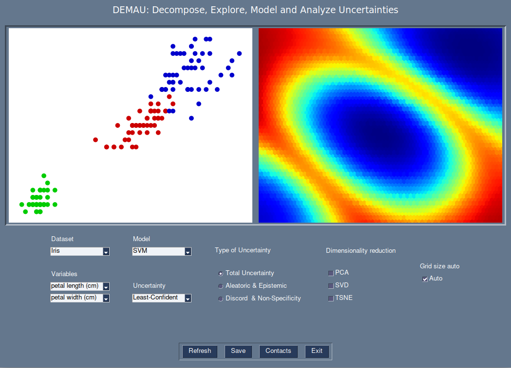
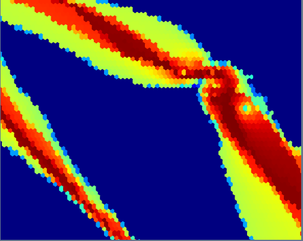
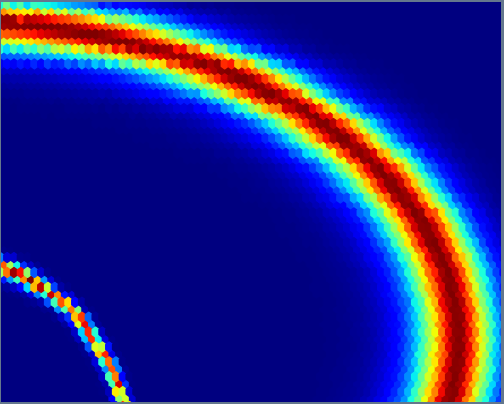
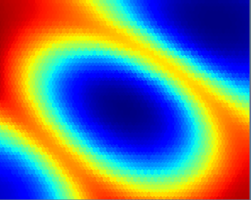
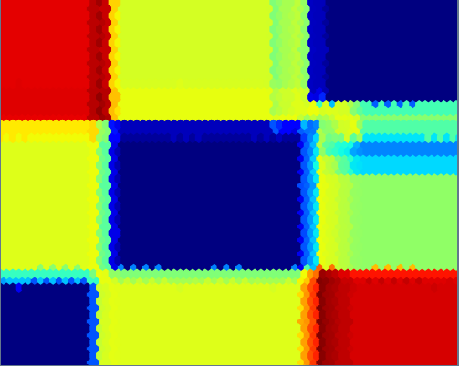
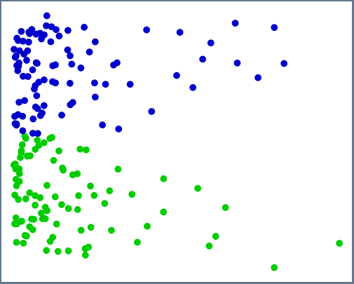
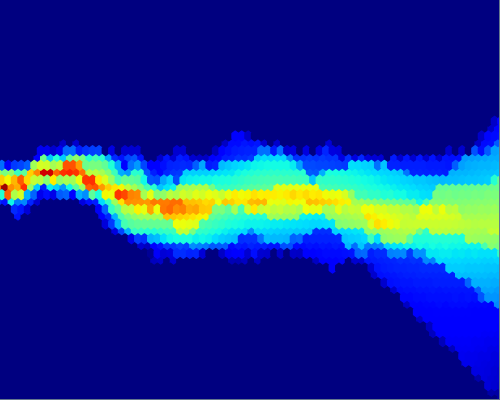
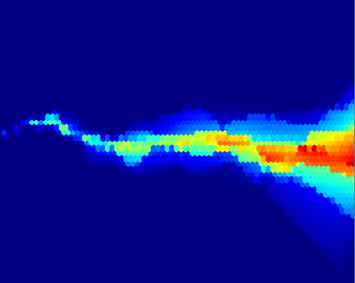
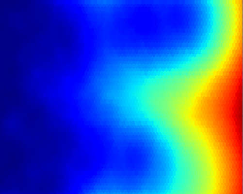

# DEMAU: Decompose, Explore, Model and Analyze Uncertainties

DEMAU is an open-source Python software for educational, exploratory and
analytical purposes allowing to visualize and explore several types of uncertainty
for classification models in machine learning.  

  

## Reference

Arthur H, Vincent L. (2024) DEMAU: Decompose, Explore, Model and Analyze Uncertainties.

## Simple run

If you simply want to run DEMAU on your datasets, please follow the steps below.

### Linux

Download [DEMAU_linux](https://www.dropbox.com/scl/fi/awmggk003fuu8yjl7nq31/DEMAU_linux.zip?rlkey=75zc0j9nf17blffchuai7h9k1&dl=0)  
Simply run __DEMAU.linux__ file.

### Windows

Download [DEMAU_windows](https://www.dropbox.com/scl/fi/wsu7hufuroukgd3m71ovs/DEMAU.zip?rlkey=3palpjt6vd4c3sedx478iuv7z&dl=0)  
Run __DEMAU.exe__ on for Windows OS.

## Python run

If you are familiar with Python and want to customize DEMAU, you can directly run the python script from this.

### Run DEMAU

Run __main.py__ through your Python interpreter.

#### Prerequisites

You might have to install the following dependencies:  
You can use _pip_ to install the libraries.

```pip3 install -r requirements.txt```

## Tutorial video

## Machine learing models uncertainty

 

## Uncertainty decomposition

 